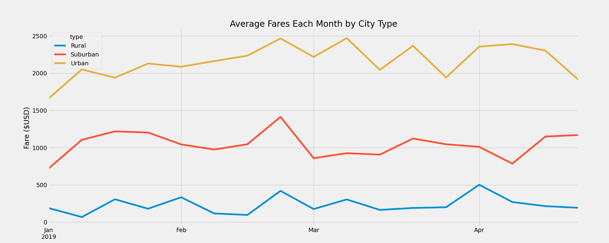

# Challenge-5
## Pyber Data Analysis
### Overview
Going over the data, I was able to merge the 2 CSV files into an new Dataframe that can be used to pull new data points and averages. By doing this, we can see the averages for drivers, fares and rides to better understand most of the transportation needs of each city type 
 ##
 ### Data Points
 
 
##
### Summary
In this graph, we can see there is more use in transportation with urban vs rural communities. Based on this information, more transportation options could be used in Urban settings due to the amount of people that live and use these transportation options. Connections to the Rural and Suburban from the Urban areas would be a vialble option to increase transport options in those areas, therefore generating more fares.
